# MERN-auth boilerplate

[You can see screenshots of the messenger below](#screenshots)

### Features:

- Authentication with:

  - Email
  - Facebook
  - Google,

- Reset Password
- Verification email
- Diferent roles

## Install

1. `npm install` или `yarn install`
2. Delete `config-example.env` file at `server/src/config/`.
3. Create `config.env` file at `server/src/config/` and enter your values in it. More on this below.

   ```
   PORT=
   NODE_ENV=development
   CLIENT_URL=
   MONGO_URI=

   JWT_ACCOUNT_ACTIVATION=
   JWT_SECRET=
   JWT_RESET_PASSWORD=

   EMAIL_FROM=test@gmail.com
   MAIL_KEY=

   GOOGLE_CLIENT=

   ```

4. Create `.env` file at `client/` and enter your values in it. More on this below.

   ```
   REACT_APP_API_URL=http://localhost:5000/api
   REACT_APP_FACEBOOK_CLIENT=
   REACT_APP_GOOGLE_CLIENT=

   ```

5. Install MongoDB and start it.

6. Run command `npm run start` or `yarn start` on client and command `npm run dev` or `yarn dev` on server.

## Receiving email of confirm

I use `sendgrid`.

1. Registration to [sendgrid](https://sendgrid.com/)
2. Enter to your account on this service.
3. In sidebar open `Settings => API Keys => Create API key`. You are offered to copy the API key only once. Further it will not be possible to see it.
4. Open file `server/src/config/config.env`(if there is no file, then create it) and specify in the `MAIL_KEY` the API key that gave you `sendgrid`.
   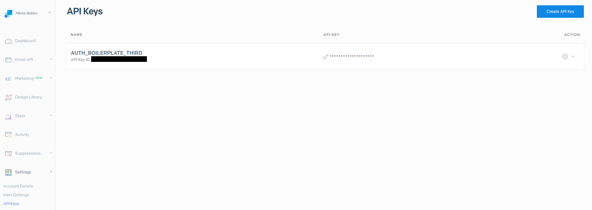
5. Next, you will be prompted to create a `sendler`. Follow the instructions on the website.

## [Authentication with google](https://www.youtube.com/watch?v=xH6hAW3EqLk)

Received APP KEY paste to `client/.env` => `REACT_APP_GOOGLE_CLIENT=` and to `server/src/config/config.env` => `GOOGLE_CLIENT=`

## Authentication with facebook

1. Enter to [FacebookForDevelopers](https://developers.facebook.com/)
2. Click to 'My apps'.

   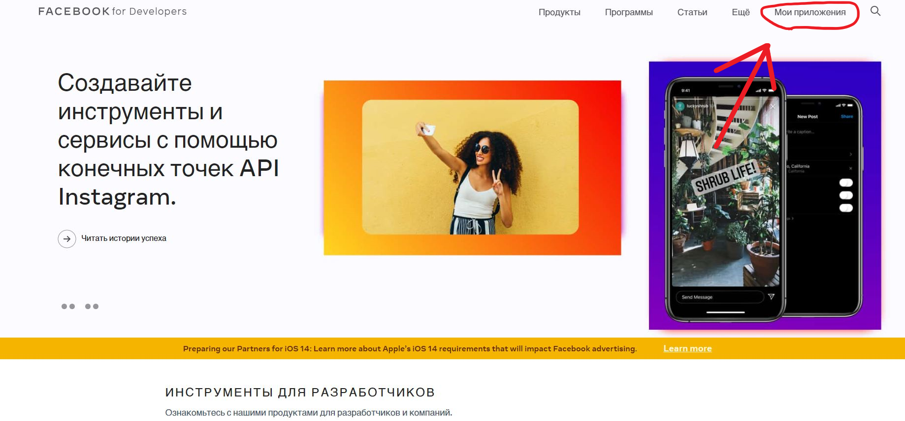

3. Click to 'Create my app'.

   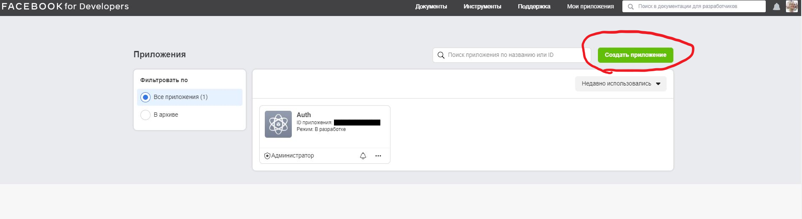

4. Click to 'Creation of cross-service functions'.

   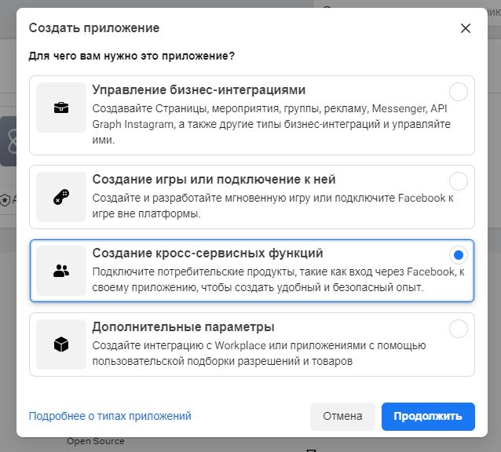

5. Copy your ID app and paste it to `server/src/config/config.env` => `REACT_APP_FACEBOOK_CLIENT=`.

   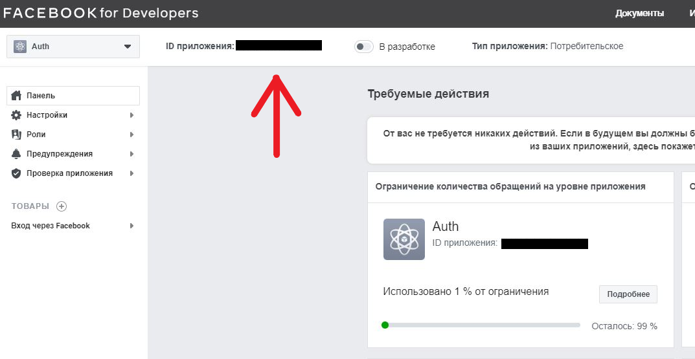

## Built With

### Frontend

- ReactJS + hooks
- React-router-dom
- PropTypes
- Axios
- React-facebook-login
- React-google-login

### Backend

- NodeJS / Express
- MongoDB / Mongoose
- Cors
- Crypto
- JsonWebToken
- JWT
- Express-jwt
- Express-validator
- Google-auth-library
- Lodash
- Morgan
- Node-fetch

## <a name="screenshots">Screenshots</a>

<div align="center" >
  <h3>Main</h3>
  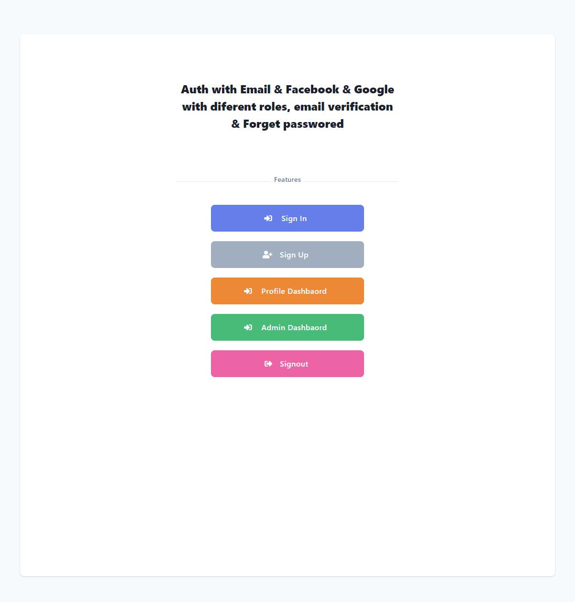
 
  <h3>Sign Up</h3>
  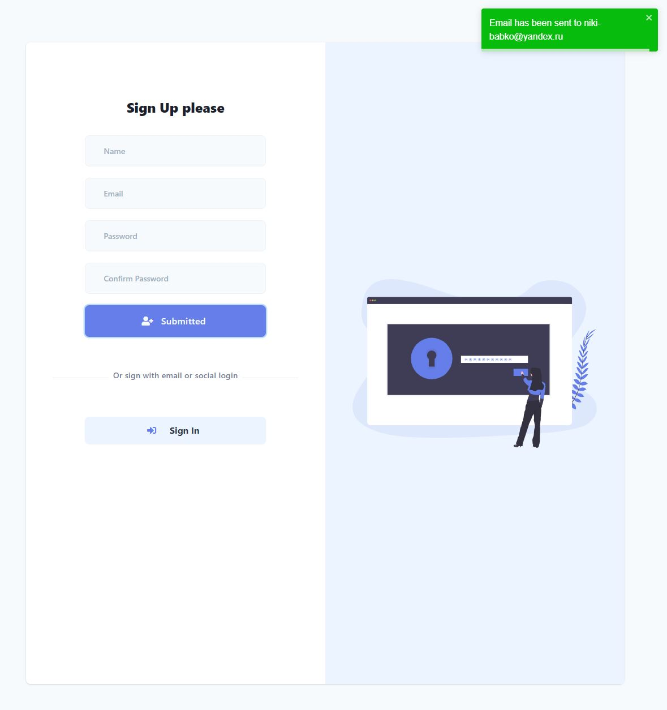
  
  <h3>Activate your account</h3>
  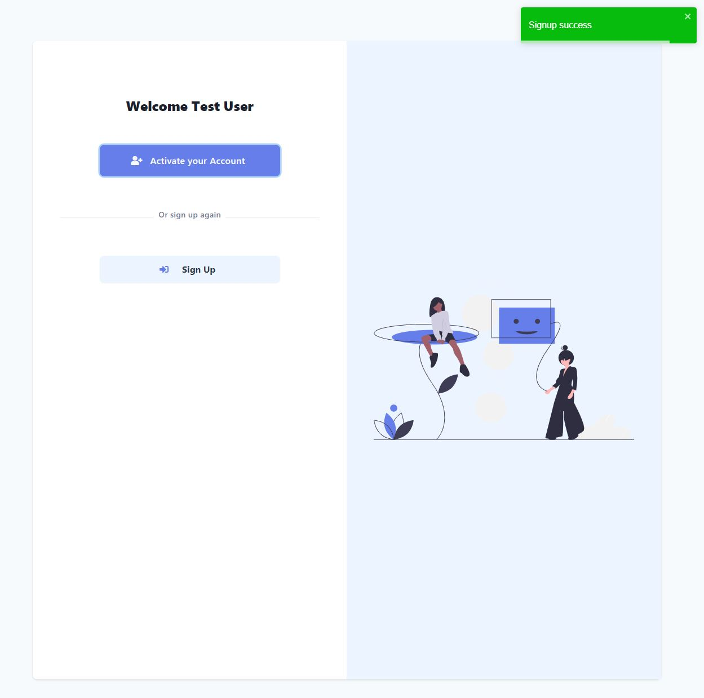

  <h3>Sign In</h3>
  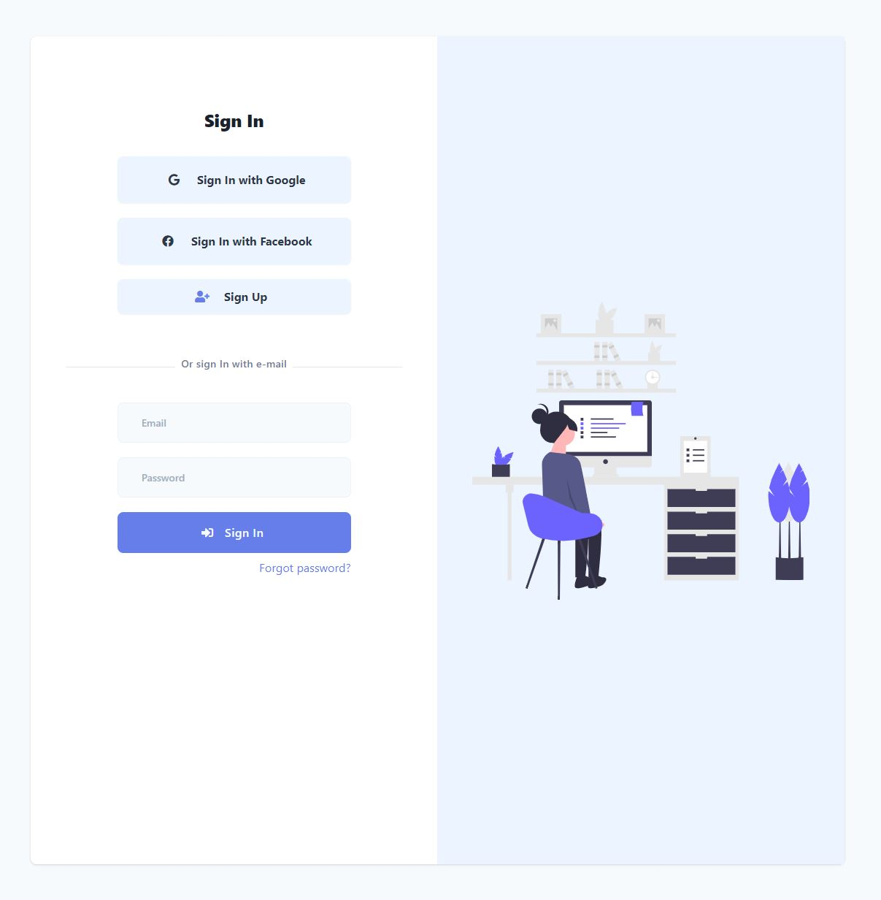

  <h3>Profile</h3>
  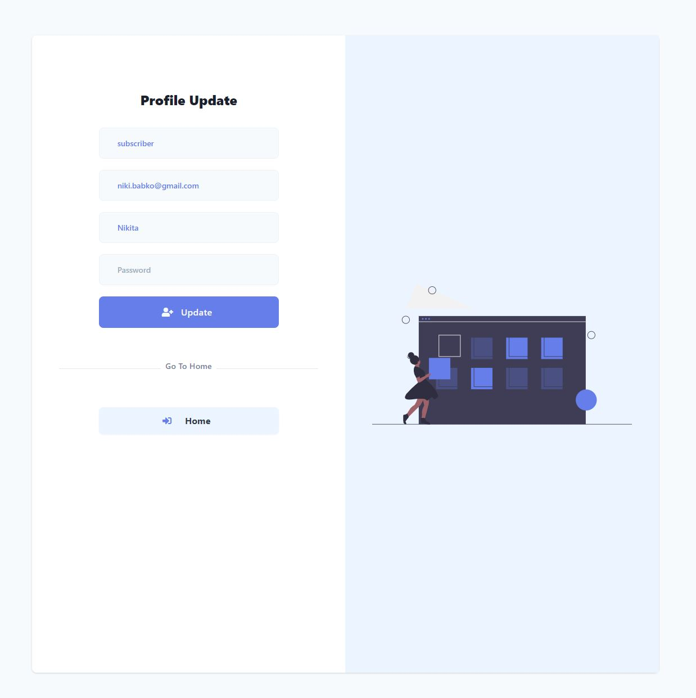
  
  <h3>Forgot password</h3>
  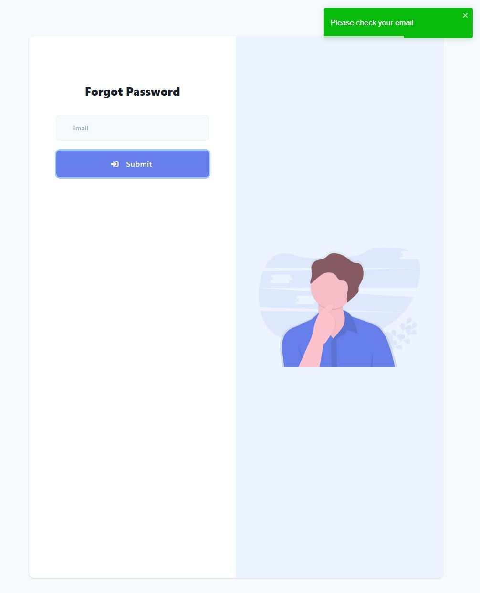

  <h3>Reset password</h3>
  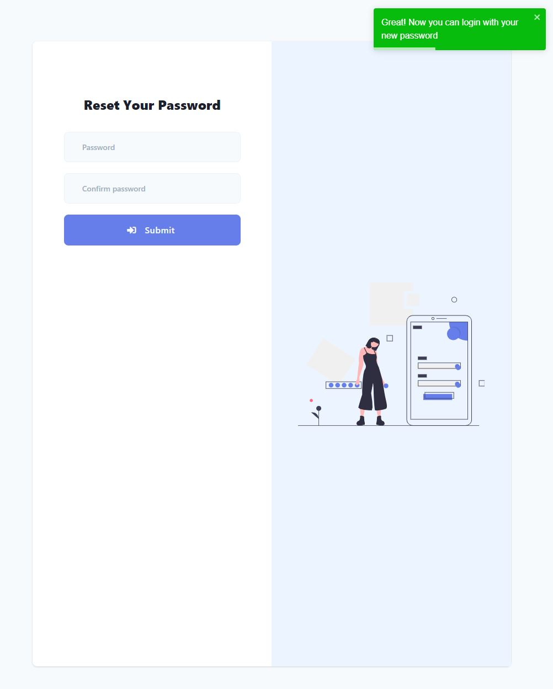

</div>
